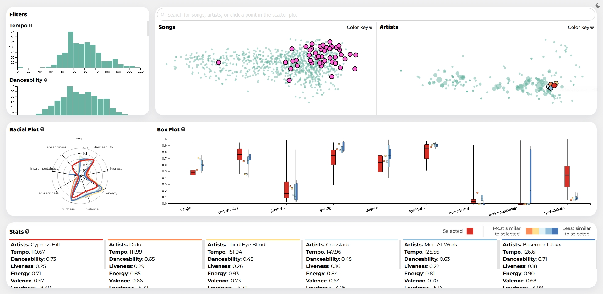

# Visual Analytics Project
## Recommendation system for Spotify songs

### Authors
- Alessio Parmeggiani
- Alessio Sfregola

### About
This project consists in a visual interface to find new songs based on those you already like. After searching for a song in the search bar the system highlights the selected song in a scatter plot, together with the 5 songs most similar to it according to a closeness metric calculated on some parameters automatically computed by Spotify algorithms. These parameters can be explored in the lower section of the screen, along with some useful information about the songs and their artists. On the left there is a section with filters that allow the system to only show songs that align with one's tastes. It also features some histograms to see the distribution of these parameters along the chosen dataset. An additional section featuring box plots is useful to see the how these parameters are distributed along the songs produced by the same artist and those most similar to them.

For more information you can read the project report.
 
 
[![Project]][Project link] 

### Starting the application
Start a local server (using VSCode live server for example) and navigate to index/index.html on your web browser (tested with Firefox)

Or you can click here and test a demo.
 
 
[![Click here]][Click link] 

[Click here]: https://img.shields.io/badge/demo-37a779?style=for-the-badge
[Click link]: https://alessio-17.github.io/Visual_Analytics_Spotify/

[Project]: https://img.shields.io/badge/report-d4262f?style=for-the-badge
[Project link]: https://github.com/Alessio-17/Visual_Analytics_Spotify/blob/master/Report.pdf
